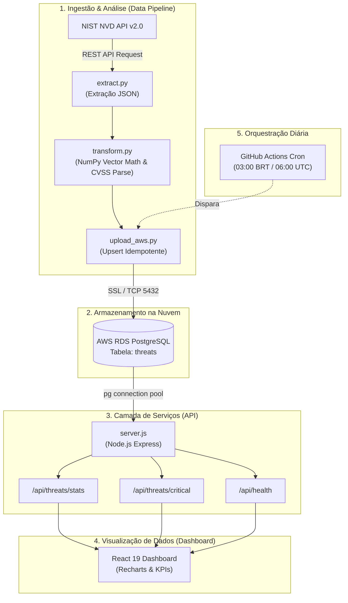

# 🛡️ Cyber Threat Intel Pipeline

> Um pipeline de dados de ponta a ponta construído para extrair, processar, analisar e visualizar vulnerabilidades de cibersegurança (CVEs) em tempo real a partir da base global do NIST NVD.


---

## 📌 Sumário

- [Visão Geral](#-visão-geral)
- [Arquitetura da Solução](#-arquitetura-da-solução)
- [Tecnologias Utilizadas (Tech Stack)](#-tecnologias-utilizadas-tech-stack)
- [Estrutura do Repositório](#-estrutura-do-repositório)
- [Modelagem de Dados (PostgreSQL)](#-modelagem-de-dados-postgresql)
- [Documentação da API REST](#-documentação-da-api-rest)
- [Como Executar o Projeto Localmente](#-como-executar-o-projeto-localmente)
  - [1. Pré-requisitos](#1-pré-requisitos)
  - [2. Configuração de Variáveis de Ambiente](#2-configuração-de-variáveis-de-ambiente)
  - [3. Executando o Pipeline ETL (Python)](#3-executando-o-pipeline-etl-python)
  - [4. Executando o Backend (Node.js/Express)](#4-executando-o-backend-nodejsexpress)
  - [5. Executando o Frontend (React/Vite)](#5-executando-o-frontend-reactvite)
- [Automação e CI/CD (GitHub Actions)](#-automação-e-cicd-github-actions)
- [Licença](#-licença)

---

## 🎯 Visão Geral

O **Cyber Threat Intel Pipeline** é um ecossistema projetado para simular uma operação real de **Threat Intelligence** corporativa. 

O sistema ingere dados brutos de vulnerabilidades conhecidas (CVEs - *Common Vulnerabilities and Exposures*) diretamente da API do **NIST NVD (National Vulnerability Database)**, aplica transformações e cálculos estatísticos vetoriais de risco com **NumPy**, persiste as ameaças de forma idempotente em um banco **PostgreSQL gerenciado na AWS (RDS)** e disponibiliza métricas analíticas e dashboards dinâmicos para analistas de segurança da informação (SOC / CTI).

---

## 🏛️ Arquitetura da Solução



---

## 🚀 Tecnologias Utilizadas (Tech Stack)

| Camada | Tecnologia | Função no Sistema |
| :--- | :--- | :--- |
| **Data Engine (ETL)** | `Python 3.10+`, `NumPy`, `Requests`, `Psycopg2` | Ingestão REST, parsing de JSON aninhado, categorização por severidade CVSS v3.x e análise estatística matricial. |
| **Armazenamento / Cloud** | `PostgreSQL` na `AWS RDS` | Persistência relacional otimizada para queries analíticas, com cláusulas `ON CONFLICT` para sincronização incremental. |
| **Backend REST API** | `Node.js`, `Express`, `node-postgres (pg)`, `CORS` | Servidor assíncrono para disponibilizar rotas analíticas agregadas e listagens de alta criticidade. |
| **Frontend / UI** | `React 19`, `Vite`, `Recharts`, `Axios` | Dashboard de CTI com monitoramento de status, cartões de KPI, gráfico de barras interativo e tabela de CVEs. |
| **Automação / CI/CD** | `GitHub Actions` | Rotina agendada diária (CRON) para extração e atualização autônoma dos dados. |

---

## 📂 Estrutura do Repositório

```text
Cyber-Threat-Intel/
├── .github/
│   └── workflows/
│       └── etl_pipeline.yml     # Workflow de automação diária do ETL
├── backend/
│   ├── src/
│   │   ├── db_connect.js        # Pool de conexão PostgreSQL com SSL
│   │   └── server.js            # Servidor Express e rotas analíticas
│   ├── .env.example             # Template de variáveis do backend
│   └── package.json             # Dependências Node.js
├── data_pipeline/
│   ├── extract.py               # Extração de dados da API do NIST
│   ├── transform.py             # Tratamento e análise vetorial com NumPy
│   ├── upload_aws.py            # Carga idempotente no PostgreSQL AWS RDS
│   └── requirements.txt         # Dependências Python
├── frontend/
│   ├── src/
│   │   ├── App.jsx              # Componente principal do Dashboard
│   │   ├── App.css              # Estilos da aplicação
│   │   ├── index.css            # Estilos globais
│   │   └── main.jsx             # Ponto de entrada React
│   ├── package.json             # Dependências React/Vite
│   └── vite.config.js           # Configuração de build do Vite
├── .env.example                 # Exemplo global de variáveis de ambiente
├── .gitignore                   # Regras de exclusão do Git
└── README.md                    # Documentação do projeto
```

---

## 🗄️ Modelagem de Dados (PostgreSQL)

O pipeline cria e atualiza a tabela **`threats`** no banco relacional:

```sql
CREATE TABLE IF NOT EXISTS threats (
    cve_id VARCHAR(50) PRIMARY KEY,
    descricao TEXT,
    nota_cvss FLOAT,
    severidade VARCHAR(20),
    data_extracao TIMESTAMP DEFAULT CURRENT_TIMESTAMP
);
```

### Dicionário de Dados

| Campo | Tipo | Descrição |
| :--- | :--- | :--- |
| `cve_id` | `VARCHAR(50)` | Identificador universal da vulnerabilidade (Ex: `CVE-2024-1234`). Chave primária. |
| `descricao` | `TEXT` | Resumo técnico detalhado da vulnerabilidade (em inglês). |
| `nota_cvss` | `FLOAT` | Pontuação de impacto base no padrão CVSS v3.x (escala de 0.0 a 10.0). |
| `severidade` | `VARCHAR(20)` | Classificação de risco (`CRITICAL`, `HIGH`, `MEDIUM`, `LOW`, `UNKNOWN`). |
| `data_extracao`| `TIMESTAMP` | Carimbo de data/hora da última sincronização do registro. |

---

## 📡 Documentação da API REST

A API do backend é servida por padrão em `http://localhost:5001`.

### 1. `GET /api/health`
Retorna o status de saúde da API.

* **Exemplo de Resposta:**
```json
{
  "status": "OK",
  "message": "Cyber Threat API rodando com sucesso!"
}
```

---

### 2. `GET /api/threats/stats`
Consolida métricas e estatísticas gerais para a montagem dos gráficos e KPIs.

* **Exemplo de Resposta:**
```json
{
  "total_ameacas": "2000",
  "criticas": "142",
  "altas": "486",
  "medias": "720",
  "baixas": "118",
  "pior_risco": 10.0
}
```

---

### 3. `GET /api/threats/critical`
Retorna as 20 ameaças mais severas (CVSS $\ge 7.0$), ordenadas pelo score decrescente.

* **Exemplo de Resposta:**
```json
[
  {
    "cve_id": "CVE-2024-38077",
    "descricao": "Windows Remote Desktop Licensing Service Remote Code Execution Vulnerability...",
    "nota_cvss": 9.8,
    "severidade": "CRITICAL",
    "data_extracao": "2026-08-17T06:00:15.000Z"
  }
]
```

---

## 💻 Como Executar o Projeto Localmente

### 1. Pré-requisitos

* **Python 3.10+**
* **Node.js 18+** e **npm**
* **PostgreSQL** local ou instância remota na **AWS RDS**
* Chave gratuita da API do NIST NVD: [Solicitar API Key](https://nvd.nist.gov/developers/request-an-api-key)

---

### 2. Configuração de Variáveis de Ambiente

Copie o arquivo de exemplo `.env.example` para `.env` na raiz do projeto:

```bash
cp .env.example .env
```

Edite o arquivo `.env` com suas credenciais:

```env
NIST_API_KEY=sua_chave_nist_aqui
DB_HOST=seu-rds-host.amazonaws.com
DB_NAME=postgres
DB_USER=postgres
DB_PASSWORD=sua_senha_secreta
DB_PORT=5432
PORT=5001
VITE_API_URL=http://localhost:5001
```

---

### 3. Executando o Pipeline ETL (Python)

1. Crie e ative um ambiente virtual:
```bash
# macOS / Linux
python3 -m venv venv
source venv/bin/activate

# Windows
python -m venv venv
.\venv\Scripts\activate
```

2. Instale as dependências:
```bash
pip install -r data_pipeline/requirements.txt
```

3. Execute o pipeline de extração, transformação e upload:
```bash
python data_pipeline/upload_aws.py
```

O terminal exibirá o resumo analítico gerado pela matriz do NumPy e a confirmação de sincronização no banco de dados.

---

### 4. Executando o Backend (Node.js/Express)

1. Abra um terminal na pasta `backend`:
```bash
cd backend
```

2. Instale as dependências:
```bash
npm install
```

3. Inicie o servidor:
```bash
npm start
```

O backend estará ativo em `http://localhost:5001`.

---

### 5. Executando o Frontend (React/Vite)

1. Abra um terminal na pasta `frontend`:
```bash
cd frontend
```

2. Instale as dependências:
```bash
npm install
```

3. Inicie o servidor de desenvolvimento:
```bash
npm run dev
```

4. Acesse a aplicação no seu navegador: `http://localhost:5173`.

---

## ⚙️ Automação e CI/CD (GitHub Actions)

O repositório possui uma pipeline de integração e sincronização contínua configurada em [`.github/workflows/etl_pipeline.yml`](.github/workflows/etl_pipeline.yml).

### Secrets Necessárias no Repositório GitHub

Para que a automação execute com sucesso, adicione as seguintes **Repository Secrets** nas configurações do seu repositório no GitHub (`Settings > Secrets and variables > Actions`):

* `NIST_API_KEY`: Sua chave da API do NIST.
* `DB_HOST`: Endpoint da instância AWS RDS.
* `DB_NAME`: Nome do banco de dados (ex: `postgres`).
* `DB_USER`: Usuário do banco de dados.
* `DB_PASSWORD`: Senha de acesso.
* `DB_PORT`: Porta de conexão (padrão: `5432`).

---

## 📄 Licença

Este projeto é distribuído sob a licença ISC. Consulte o arquivo de licença ou package.json para mais informações.
